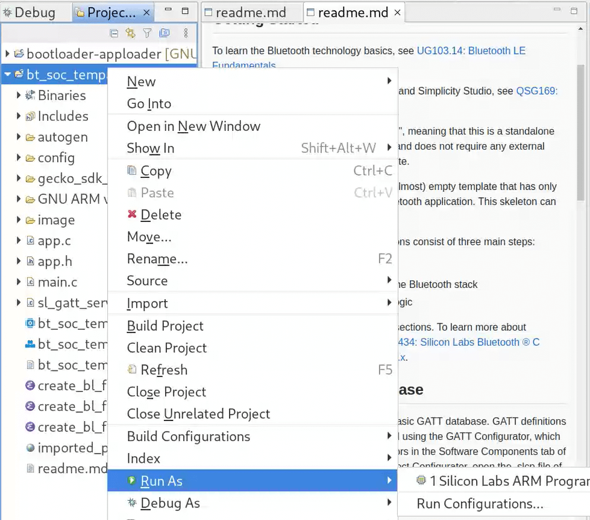

# Funpack S3#1 Temperature Sensor


Prebuilt image and Linux UI are available in the release page.

## Build

### MCU

Notice: You need to flash a bootloader (Bluetooth AppLoader OTA DFU) first.

Import the project into SimplicityStudio: Project -> Import -> MCU Project.


Then build and flush the application: Right Click -> Run As -> Silicon Labs ARM Program



### UI

Build and run the ui:

``` shell
cd ui
RUST_LOG=info cargo run
```

